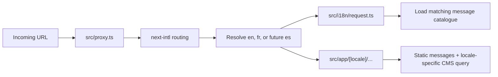
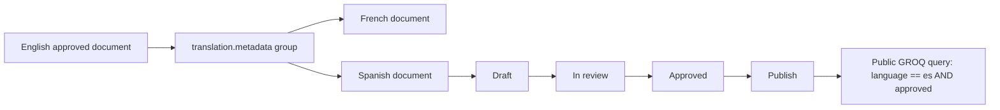

# Spanish localization implementation guide

> Audience: the Hive Vault Arc co-founder or engineer adding Spanish to the website and Sanity Studio.
>
> Scope: reproduce the current English/French localization architecture for Spanish without duplicating documents, breaking translation links, publishing incomplete copy, or serving English content under Spanish URLs.
>
> Current state: English (`en`) is the default, unprefixed website; French (`fr`) uses `/fr`; Spanish is not implemented yet. This file is an implementation blueprint, not evidence that Spanish is already live.

## 1. The target state

After this work, the platform should have three first-class languages:

| Concern                  | English                                              | French                           | Spanish target       |
| ------------------------ | ---------------------------------------------------- | -------------------------------- | -------------------- |
| Application locale       | `en`                                                 | `fr`                             | `es`                 |
| URL prefix               | none                                                 | `/fr`                            | `/es`                |
| CMS `language` value     | `en`                                                 | `fr`                             | `es`                 |
| Formatting locale        | `en-GB` or the existing page-specific English locale | `fr-FR`                          | `es-ES`              |
| Open Graph locale        | `en_US`                                              | `fr_FR`                          | `es_ES`              |
| Public CMS gate          | published + approved                                 | published + approved             | published + approved |
| Translation relationship | `translation.metadata` reference                     | `translation.metadata` reference | same metadata group  |

The Spanish implementation must preserve these rules:

1. English remains the source language and default locale.
2. English URLs remain unprefixed. Do not introduce `/en` as the canonical English URL.
3. Spanish uses document-level localization in Sanity, just like French. A Spanish document is a separate document, not a set of Spanish fields inside the English document.
4. Static interface copy is owned by the frontend message catalogue. CMS editorial copy is owned by Sanity.
5. A CMS document is public only when it is both published and has `translationStatus: "approved"`.
6. A language switch on a dynamic page is enabled only when an approved translation target exists.
7. Spanish pages must not silently publish English editorial copy. If Spanish content is missing, keep the translation unavailable rather than indexing a misleading Spanish URL.
8. Exact client quotations, testimonial files, brand names, product names, URLs, IDs, dates, metrics, and source references are not machine-translated.

Before implementation, confirm that Spain-oriented Spanish is the intended editorial variant. This guide uses `es` for application and CMS storage and `es-ES` / `es_ES` for formatting and social metadata. If the business wants Latin American or another regional Spanish variant, decide that before copy production begins; do not mix dialects after launch.

## 2. How localization is divided today

The website has more than one translation source. Adding `es.json` alone will not translate the whole site.

| Content class                                 | Current owner                       | Examples                                                                           | Spanish action                                                                         |
| --------------------------------------------- | ----------------------------------- | ---------------------------------------------------------------------------------- | -------------------------------------------------------------------------------------- |
| Static UI copy                                | `Hva-website-front/messages/*.json` | navigation, footer, buttons, form labels, static page sections, metadata copy      | add `messages/es.json` with identical key structure                                    |
| Localized URL paths                           | `src/i18n/routing.ts`               | `/capabilities` ↔ `/fr/expertises`                                                 | add an `es` pathname for every configured route                                        |
| CMS editorial documents                       | Sanity dataset                      | capabilities, industries, people, posts, news, perspectives, reports, case studies | create linked Spanish documents, translate, review, approve, publish                   |
| Local fallback editorial data                 | frontend TypeScript files           | resilient insights, CMS fallback patches, positioning, FAQs                        | add reviewed Spanish content or remove the need for the fallback                       |
| Structured data and hardcoded locale branches | frontend React/TypeScript           | JSON-LD names, descriptions, date formatting, Open Graph locales                   | replace two-language conditionals with locale maps or message keys                     |
| Assets and exact evidence                     | Sanity assets/references            | covers, screenshots, logos, PDFs, signed testimonial letters                       | normally reuse the asset reference; translate only alt text/captions where appropriate |

The current static catalogue has these top-level namespaces:

`Locale`, `Navigation`, `Footer`, `Common`, `Errors`, `Contact`, `Collections`, `HomeHero`, `HomeDecision`, `Home`, `InsightsCarousel`, `TrustedBy`, `Arc`, `Capabilities`, `Evidence`, `DynamicContent`, `Links`, `SolutionPrograms`, `CapabilitiesDetail`, `Privacy`, `Legal`, `ArticleUi`, `InsightsHub`, `CollectionUi`, `BlogIndex`, `CaseStudiesIndex`, `Portfolio`, `About`, `Industries`, `GeoPages`, `Faqs`, and `Metadata`.

Spanish must contain the same namespaces, nested keys, arrays, and interpolation variables.

## 3. The existing English/French architecture

### 3.1 Request and routing flow



Important current decisions:

- `next-intl` owns locale routing.
- `localePrefix: "as-needed"` leaves English unprefixed and prefixes non-default languages.
- Browser locale detection and locale cookies are disabled. The user chooses a language explicitly or visits a localized URL.
- The English route name is the canonical internal route key. `routing.ts` maps it to each localized public pathname.
- `src/proxy.ts` is already based on the central routing configuration and should become Spanish-aware when that configuration is extended.

### 3.2 CMS document flow



Sanity localization is defined in `hva-website-studio/schemaTypes/localization.ts`:

- `SUPPORTED_LANGUAGES` currently contains English and French.
- `LOCALIZED_SCHEMA_TYPES` currently includes:
  - `post`
  - `newsArticle`
  - `perspective`
  - `researchReport`
  - `caseStudy`
  - `employeeProfile`
  - `capability`
  - `industry`
- Every localized document receives a `language` field and a `translationStatus` field.
- Approval validates required visitor-facing content per schema type.
- Slug uniqueness is scoped by language, so corresponding English, French, and Spanish records can have different slugs.
- The document internationalization plugin stores relationships in `translation.metadata` documents.

The public frontend queries must filter by both locale and approval status. The established pattern is equivalent to:

```groq
*[
  _type == $type &&
  language == $locale &&
  translationStatus == "approved"
]
```

Preview can intentionally relax the approval rule, but production must not.

### 3.3 Dynamic language switching

Static routes can be calculated from `routing.ts`. Dynamic routes need the translated document slug.

Sanity queries expose approved `translationTargets`. The page passes those targets to the translation availability context. `LocaleSwitcher.tsx` then:

1. recognizes whether the current page is dynamic;
2. finds the approved route for each language;
3. enables only available language destinations;
4. preserves the correct translated slug rather than mechanically changing `/fr` to `/es`.

This prevents a switch from an English case study to a nonexistent Spanish slug.

## 4. What was done for French

French was integrated in layers. Spanish should follow the same architecture, but not blindly rerun the historical French migration scripts.

### Layer 1 — content inventory and language standards

The project separated Git-owned copy from Sanity-owned copy and documented:

- the localization content inventory;
- a French editorial style guide;
- a protected English–French glossary;
- a localized route manifest;
- an implementation and quality audit.

These live in `Hva-website-front/docs/localization/`.

### Layer 2 — frontend locale foundation

The frontend added:

- `fr` to the application locales;
- a French message catalogue;
- localized pathnames in `routing.ts`;
- a request-time catalogue map;
- localized metadata, canonicals, alternate links, sitemap entries, and structured data;
- a locale switcher aware of dynamic translation availability;
- localization tests and browser tests.

### Layer 3 — Sanity document localization

The Studio added:

- a `language` field;
- a `translationStatus` workflow;
- the document internationalization plugin;
- document-level English/French translation groups;
- language-scoped slug validation;
- locale-aware preview URLs;
- public query rules that require an approved translation.

### Layer 4 — French content migration and publication

Historical scripts then:

1. normalized the English source documents;
2. created French draft documents;
3. created or updated translation metadata linking English and French;
4. translated visitor-facing content with protected terms and curated overrides;
5. audited French copy;
6. set valid records to approved;
7. published them;
8. strengthened translation references after publication;
9. verified counts, relationships, approval, and copy differences.

The relevant historical files include:

- `scripts/migrate-localization-baseline.mjs`
- `scripts/create-french-translation-drafts.mjs`
- `scripts/publish-french-localizations.mjs`
- `scripts/french-localization-overrides.mjs`
- `scripts/audit-french-localization-content.mjs`
- `scripts/strengthen-published-translation-references.mjs`
- `scripts/verify-localization-state.mjs`

### Critical warning about those scripts

Several French scripts encode the dataset shape and expected record counts from the moment French was first introduced. Some expect 23 or 24 documents, assume only `en` and `fr`, or create new metadata documents from a zero-localization baseline.

Do **not** rename `fr` to `es` and run them.

The live dataset now contains more content, industries, case-study media, testimonials, metrics, and existing translation metadata. Spanish migration must inventory the current dataset and append Spanish references to existing translation groups. Otherwise it can miss content, duplicate metadata, or break existing English/French associations.

## 5. Spanish route vocabulary

Agree on the Spanish SEO vocabulary before implementation. A proposed Spain-oriented route map is below. The left column remains the canonical internal route key used by the code.

| Internal route key                | Current French                        | Proposed Spanish                           |
| --------------------------------- | ------------------------------------- | ------------------------------------------ |
| `/`                               | `/` under `/fr`                       | `/` under `/es`                            |
| `/arc`                            | `/arc`                                | `/arc`                                     |
| `/capabilities`                   | `/expertises`                         | `/capacidades`                             |
| `/capabilities/in-detail`         | `/expertises/en-detail`               | `/capacidades/en-detalle`                  |
| `/capabilities/solution-programs` | `/expertises/programmes-solutions`    | `/capacidades/programas-de-soluciones`     |
| `/capabilities/[slug]`            | `/expertises/[slug]`                  | `/capacidades/[slug]`                      |
| `/industries`                     | `/secteurs`                           | `/sectores`                                |
| `/aboutus`                        | `/qui-sommes-nous`                    | `/quienes-somos`                           |
| `/aboutus/our-people/[employee]`  | `/qui-sommes-nous/equipe/[employee]`  | `/quienes-somos/equipo/[employee]`         |
| `/whoarewe/portfolio`             | `/qui-sommes-nous/portfolio`          | `/quienes-somos/portfolio`                 |
| `/insights`                       | `/publications`                       | `/publicaciones`                           |
| `/blog`                           | `/blog`                               | `/blog`                                    |
| `/blog/[slug]`                    | `/blog/[slug]`                        | `/blog/[slug]`                             |
| `/case-studies`                   | `/etudes-de-cas`                      | `/casos-de-estudio`                        |
| `/case-studies/[slug]`            | `/etudes-de-cas/[slug]`               | `/casos-de-estudio/[slug]`                 |
| `/news`                           | `/publications/actualites`            | `/publicaciones/noticias`                  |
| `/perspectives`                   | `/publications/perspectives`          | `/publicaciones/perspectivas`              |
| `/research`                       | `/publications/rapports-de-recherche` | `/publicaciones/informes-de-investigacion` |
| `/contact`                        | `/contact`                            | `/contacto`                                |
| `/privacy-policy`                 | `/politique-de-confidentialite`       | `/politica-de-privacidad`                  |
| `/mentions-legales`               | `/mentions-legales`                   | `/avisos-legales`                          |
| `/links`                          | `/liens`                              | `/enlaces`                                 |

The geo-service routes also need deliberate Spanish names. Do not translate a route word-for-word without keyword review. Every path must be unique within the Spanish locale, stable after launch, and represented in tests, canonicals, alternate links, and the sitemap.

## 6. Frontend implementation, file by file

### 6.1 Add the application locale

Edit `Hva-website-front/src/i18n/config.ts`:

```ts
export const APP_LOCALES = ["en", "fr", "es"] as const;
export type AppLocale = (typeof APP_LOCALES)[number];
export const DEFAULT_LOCALE: AppLocale = "en";
```

Keep English as the default.

### 6.2 Add every Spanish pathname

Edit `src/i18n/routing.ts` and add `es` to every object that currently has `en` and `fr`.

```ts
'/capabilities': {
  en: '/capabilities',
  fr: '/expertises',
  es: '/capacidades',
},
```

Do not leave any configured route with only two languages. `next-intl` route typing and localized navigation depend on complete mappings.

Preserve:

```ts
localePrefix: 'as-needed',
localeDetection: false,
localeCookie: false,
alternateLinks: false,
```

Alternate links are generated by the project metadata helpers, not automatically by middleware.

### 6.3 Create and register the Spanish message catalogue

Create `Hva-website-front/messages/es.json` from `messages/en.json`, not from French. Translate values, never keys.

Then edit `src/i18n/request.ts`:

```ts
import enMessages from "../../messages/en.json";
import esMessages from "../../messages/es.json";
import frMessages from "../../messages/fr.json";

const MESSAGE_CATALOGS = {
  en: enMessages,
  fr: frMessages,
  es: esMessages,
} as const;
```

Catalogue rules:

- keep every object key identical;
- keep array lengths and ordering identical;
- preserve placeholders such as `{name}`, `{count}`, and rich-text tag markers;
- preserve intentional line-break structure where layout depends on arrays;
- do not translate URLs, email addresses, brand names, API names, or product names;
- translate image-independent accessibility labels;
- translate page title and description values in `Metadata`;
- review every string in the interface, including error and empty states.

Create `docs/localization/spanish-style-guide.md`. Extend `docs/localization/glossary.md` to English–French–Spanish or add a dedicated Spanish glossary. Decide formal address, capitalization, punctuation, anglicisms, and preferred translations for recurring HVA terms before bulk translation.

### 6.4 Make the route manifest locale-generic

`src/i18n/route-manifest.ts` contains two-language assumptions. Refactor rather than stacking more `if (locale === 'fr')` branches.

Current concepts that must change:

- `localePrefix` currently returns only `''` or `'/fr'`;
- `localizedAlternates` currently iterates only English and French;
- dynamic parameter records need an `es` member when a Spanish slug exists.

Recommended shape:

```ts
export function localePrefix(locale: AppLocale): string {
  return locale === DEFAULT_LOCALE ? "" : `/${locale}`;
}

export function localizedAlternates(routeKey: RouteKey, params?: RouteParams) {
  return Object.fromEntries(
    APP_LOCALES.map((locale) => [
      locale,
      localizedPath(routeKey, locale, params),
    ]),
  );
}
```

Use the actual function signatures already present in the file. The important requirement is that `APP_LOCALES`, not a duplicated `['en', 'fr']`, drives all language loops.

### 6.5 Extend the locale switcher

`src/components/localization/LocaleSwitcher.tsx` already maps `APP_LOCALES`, so adding `es` will create a third option. Add Spanish language names to the `Locale` message namespace in all three catalogues, for example:

```json
{
  "Locale": {
    "languages": {
      "en": "English",
      "fr": "Français",
      "es": "Español"
    }
  }
}
```

Use the natural language name in each catalogue where appropriate.

`src/components/localization/TranslationAvailability.tsx` currently copies only `routes.en` and `routes.fr`. Make it include `es` or build the stable object from `APP_LOCALES`. Do not enable Spanish on a dynamic route unless its query returned an approved Spanish target.

Test the three-option control on desktop and mobile. Check width, keyboard navigation, focus state, selected state, and long French/Spanish labels.

### 6.6 Remove two-language conditionals

Search for two-locale assumptions:

```powershell
rg -n "locale === 'fr'|language === 'fr'|'en', 'fr'|/fr" src e2e next.config.ts
```

Current affected areas include:

- `src/app/[locale]/layout.tsx`
- `src/app/[locale]/page.tsx`
- `src/app/[locale]/industries/page.tsx`
- `src/views/CapabilitiesSolutionPrograms.tsx`
- `src/views/InsightsHub.tsx`
- `src/views/Perspective.tsx`
- `src/components/ArticleDetailPage.tsx`
- `src/components/ClientEvidenceCard.tsx`
- `src/components/GeoServicePage.tsx`
- `src/components/InsightIndexPage.tsx`
- `src/lib/seo.ts`
- `src/lib/resilient-insights.ts`
- `src/lib/sanity-content.ts`
- `src/lib/positioning.ts`
- `src/data/faqs.ts`
- `src/app/api/revalidate/sanity/route.ts`

Replace binary conditions with one of these:

1. a translated message key, for visitor-facing text;
2. a typed locale map, for technical values such as `fr_FR` / `es_ES`;
3. a locale-aware data record, for local fallback content;
4. a loop over `APP_LOCALES`, for alternate links, revalidation, or test matrices.

Avoid this pattern:

```ts
const label = locale === "fr" ? french : english;
```

Spanish would incorrectly receive English. Prefer:

```ts
const labelByLocale: Record<AppLocale, string> = {
  en: english,
  fr: french,
  es: spanish,
};
```

### 6.7 Metadata, canonical URLs, and structured data

`src/app/[locale]/layout.tsx` currently contains hardcoded English/French canonical, language alternate, Open Graph, and JSON-LD branches. Add Spanish and make the implementation map-driven.

Required result for the home page:

```html
<link rel="canonical" href="https://hivevaultarc.com/es" />
<link rel="alternate" hreflang="en" href="https://hivevaultarc.com" />
<link rel="alternate" hreflang="fr" href="https://hivevaultarc.com/fr" />
<link rel="alternate" hreflang="es" href="https://hivevaultarc.com/es" />
<link rel="alternate" hreflang="x-default" href="https://hivevaultarc.com" />
```

Add a central technical locale map, for example:

```ts
const FORMAT_LOCALE: Record<AppLocale, string> = {
  en: "en-GB",
  fr: "fr-FR",
  es: "es-ES",
};

const OPEN_GRAPH_LOCALE: Record<AppLocale, string> = {
  en: "en_US",
  fr: "fr_FR",
  es: "es_ES",
};
```

Review all JSON-LD visitor-facing strings in the layout: organization descriptions, founder roles, place names, services, offer catalogue names, website descriptions, and navigation names. Move them to messages or complete locale maps. Merely changing `<html lang>` is insufficient.

Edit `src/lib/seo.ts`:

- import or derive support from `APP_LOCALES` instead of maintaining another two-item array;
- add the Spanish Open Graph locale;
- ensure Spanish alternates and canonicals use the localized public route;
- preserve `x-default` as English.

### 6.8 Sitemap and revalidation

`src/app/sitemap.ts` already loops `APP_LOCALES`, so Spanish should flow through once the locale type, route mappings, translation targets, and content functions support it. Verify rather than assume.

Every public Spanish URL must:

- appear only when its content is publishable;
- carry alternates for existing approved translations;
- use the translated slug for dynamic content;
- never point to a draft or unapproved CMS record.

Edit `src/app/api/revalidate/sanity/route.ts`. Replace the hardcoded public locales with `APP_LOCALES` or add `es` explicitly. A Spanish Sanity publication must invalidate Spanish collection, detail, sitemap, and related-content tags.

### 6.9 Date and number formatting

Update components that choose only between `fr-FR` and an English locale. Use the central formatting map for:

- article publication dates;
- case-study dates;
- insight index dates;
- number and percentage formatting where locale punctuation matters.

Do not format Spanish dates with English month names.

### 6.10 Local data and fallbacks

The project contains French-specific fallback logic, including `src/i18n/cms-fallback-fr.ts`, plus locale branches in `src/lib/resilient-insights.ts`, `src/lib/sanity-content.ts`, `src/lib/positioning.ts`, and `src/data/faqs.ts`.

Choose one explicit Spanish policy:

#### Preferred launch policy

Do not expose an indexable Spanish dynamic page until the Spanish CMS translation exists and is approved. Use translated, Git-owned Spanish static copy for static routes and approved Sanity Spanish content for CMS routes.

#### Resilience policy, if offline fallbacks are required

Create reviewed Spanish fallback records or refactor to a typed locale registry:

```ts
const CMS_FALLBACKS: Record<AppLocale, CmsFallbackSet> = {
  en: englishFallbacks,
  fr: frenchFallbacks,
  es: spanishFallbacks,
};
```

Do not send English fallback content with Spanish metadata and a Spanish canonical. That creates a poor user experience and an SEO language mismatch.

## 7. Sanity Studio implementation

### 7.1 Add Spanish to supported languages

Edit `hva-website-studio/schemaTypes/localization.ts`:

```ts
export const SUPPORTED_LANGUAGES = [
  { id: "en", title: "English" },
  { id: "fr", title: "French" },
  { id: "es", title: "Spanish" },
] as const;
```

The existing `createLocalizationFields` helper, language-scoped slug validation, approval validators, and localized schema-type list are designed to remain shared.

### 7.2 Keep document-level localization

Do not add fields such as `titleEs`, `summaryEs`, or `bodyEs` to schemas. Continue using one document per language. This keeps:

- independent editorial workflow;
- translated slugs;
- clean GROQ filtering;
- independent publication timing;
- plugin-managed translation relationships;
- consistent query shapes across languages.

### 7.3 Extend the Studio localization plugin

`hva-website-studio/sanity.config.ts` already passes the supported language configuration to the document internationalization plugin. Once `SUPPORTED_LANGUAGES` includes Spanish, verify that:

- Spanish appears in the Translations interface;
- creating a Spanish translation produces `language: "es"`;
- the new translation starts with `translationStatus: "draft"`;
- it joins the existing English/French `translation.metadata` group;
- English-only direct creation rules still work as intended;
- editors create Spanish translations through the Translations action, not as unrelated documents.

### 7.4 Fix Studio preview URLs

`sanity.config.ts` currently has a binary preview calculation:

```ts
const language = document.language === "fr" ? "fr" : "en";
```

Spanish would incorrectly preview the English page. Refactor the preview resolver to accept `en`, `fr`, and `es` and use the same route vocabulary as the frontend.

A good implementation has one locale-aware route table per document type. For dynamic documents it must combine:

- the document language;
- the localized collection path;
- the document's translated slug.

Examples:

- English case study: `/case-studies/{slug}`
- French case study: `/fr/etudes-de-cas/{slug}`
- Spanish case study: `/es/casos-de-estudio/{slug}`

Do not copy route strings into multiple unrelated switch statements if a shared typed route map can own them.

### 7.5 Deploy schema before creating Spanish documents

Build and deploy the Studio schema before asking editors to create Spanish records:

```powershell
cd "C:\Users\khali\Desktop\HVA\01 - COMPANY\ADMIN\hva-website\hva-website-studio"
npm install
npm run lint
npm run format:check
npm run build
npm run deploy
```

Then open Studio, sign in with the Hive Vault Arc workspace Google account, and confirm Spanish is available in the Translations UI.

## 8. Creating Spanish CMS content safely

### 8.1 Take a live inventory first

Do not use the historical French expected count. Query the current production dataset for:

- every approved published English document in `LOCALIZED_SCHEMA_TYPES`;
- every approved French partner;
- every existing Spanish document, if any;
- every `translation.metadata` group and its languages;
- orphan localized documents;
- duplicate metadata groups referencing the same source;
- drafts and unapproved records;
- schema-specific required fields.

The planned Spanish count should be derived from the current approved English source set, with documented exceptions. Store the inventory output with the migration review.

### 8.2 Prefer the Translations action for normal editorial work

For one or a few records:

1. open the approved English source document;
2. select **Translations**;
3. create Spanish;
4. confirm the new document has the `es` badge;
5. translate the document;
6. set status to **In review**;
7. review it;
8. set status to **Approved**;
9. publish it;
10. verify the language switch on the website.

This is safer than manually creating a Spanish document because the plugin creates the translation relationship.

### 8.3 Use a new idempotent migration for bulk creation

For the initial Spanish rollout, create a new script rather than modifying the French script in place. Suggested files and commands:

```text
scripts/create-spanish-translation-drafts.mjs
scripts/spanish-localization-overrides.mjs
scripts/publish-spanish-localizations.mjs
scripts/audit-spanish-localization-content.mjs
scripts/verify-localization-state-v2.mjs
```

Suggested package commands:

```json
{
  "localization:spanish-drafts:dry-run": "sanity exec scripts/create-spanish-translation-drafts.mjs --with-user-token",
  "localization:spanish-drafts:apply": "sanity exec scripts/create-spanish-translation-drafts.mjs --with-user-token -- --apply",
  "localization:spanish-content:dry-run": "sanity exec scripts/publish-spanish-localizations.mjs --with-user-token",
  "localization:spanish-content:apply": "sanity exec scripts/publish-spanish-localizations.mjs --with-user-token -- --apply",
  "localization:audit-es": "sanity exec scripts/audit-spanish-localization-content.mjs --with-user-token",
  "localization:verify": "sanity exec scripts/verify-localization-state-v2.mjs --with-user-token"
}
```

These commands do not exist until implemented. Do not add a package command pointing to an unreviewed script.

The draft creation algorithm must be idempotent:

1. assert the expected Sanity project ID and production dataset;
2. fetch the live approved English source set;
3. find the one existing translation metadata group for each English source;
4. stop if the source belongs to zero or multiple groups unless the exception is reviewed;
5. skip a group that already has exactly one valid Spanish member;
6. stop on duplicate Spanish members;
7. create a new random document ID for the Spanish draft;
8. clone structural data and reusable references, then set `language: "es"` and `translationStatus: "draft"`;
9. append the Spanish reference to the existing metadata group;
10. do not remove or recreate the English/French references;
11. report the complete plan in dry-run mode;
12. mutate only when `--apply` is present;
13. verify the resulting counts and relationships after commit.

Never derive new IDs by string-replacing the French document ID. Use collision-safe IDs and let the relationship metadata identify translations.

### 8.4 What to copy and what to translate

#### Reuse without translation

- asset references for covers, screenshots, logos, and files;
- internal references, unless they should point to the Spanish translation of a referenced taxonomy;
- exact metric values and units;
- dates and machine IDs;
- external URLs;
- email addresses and phone numbers;
- product names, API names, client names, and legally protected names;
- signed testimonial PDFs and original evidence files;
- exact quotes in their original language.

#### Translate and review

- title and short title;
- subtitle, summary, excerpt, and kicker;
- slugs, using the agreed Spanish SEO phrase;
- body Portable Text;
- section headings and descriptions;
- image alt text and captions;
- module and integration labels where they are visitor-facing common nouns;
- metric labels and explanations, but not the values;
- CTA copy;
- SEO title, description, and keywords;
- client evidence context and disclosure copy;
- employee position, responsibility copy, biography, and expertise labels;
- capability and industry narrative copy;
- case-study challenge, solution, modules, outcomes, captions, and testimonial framing;
- insight categories only when the taxonomy is intended to be localized.

#### Handle references deliberately

If an English insight references an English industry, the Spanish insight should reference the Spanish translation of that industry, not the English industry document. The same principle applies to related capabilities and other localized references.

Build a translation lookup from the metadata groups and remap localized references during migration. Do not change nonlocalized references.

### 8.5 Translation method

Machine translation may create a first draft, but approval requires human editorial review. The French pipeline used protected-term replacement and curated overrides; Spanish should do the same.

The protected-term list should include at least:

- Hive Vault Arc;
- ARC Framework;
- client and partner names;
- technology product names;
- WhatsApp, HubSpot, Salesforce, Sanity, Next.js, and similar trademarks;
- URLs, emails, code, IDs, and metric expressions;
- quotation text that must remain exact.

The translation process should:

1. temporarily protect nontranslatable tokens;
2. translate only visitor-facing strings;
3. restore tokens exactly;
4. apply curated Spanish overrides;
5. validate Portable Text structure and keys;
6. compare required fields with the English source;
7. leave the record as draft until human review;
8. approve and publish only after audit.

Do not automatically label machine output as approved.

### 8.6 Schema-specific review checklist

#### Capabilities

- title, short title, kicker, summary, narrative sections;
- benefit and delivery copy;
- related labels and SEO;
- translated slug;
- translated references where applicable.

#### Industries

- title, short title, description, operational copy;
- translated slug;
- correct Spanish taxonomy reference from every Spanish insight.

#### Employee profiles

- name stays unchanged;
- role, responsibility, summary, expertise, image alt, and SEO are translated;
- LinkedIn URL and image stay unchanged.

#### Insights

For posts, news, perspectives, and research reports:

- title, subtitle, excerpt, body, headings, captions, author labels, and SEO;
- Spanish slug;
- publication date preserved;
- correct Spanish industry reference;
- sources and URLs preserved;
- cover asset normally reused; alt text translated;
- related-content links verified.

#### Case studies

- title, summary, business challenge, solution delivered, modules, integrations, captions, outcome labels/descriptions, status copy, CTA, and SEO;
- figures unchanged unless the source record is corrected;
- client logo, product screenshots, testimonial PDF, and other evidence assets reused;
- exact testimonial quote remains in the original language when legal/evidentiary accuracy requires it; provide translated context separately if approved;
- every claim retains the same verification/disclosure status as its source.

## 9. Frontend CMS integration for Spanish

### 9.1 Types and query inputs

Any helper typed with `AppLocale` becomes Spanish-capable after `APP_LOCALES` changes, but inspect runtime validators and explicit arrays. API routes, data loaders, static parameter generation, and revalidation must all accept `es`.

### 9.2 Translation targets

GROQ projections that expose translation targets should remain language-generic. They must return only approved translated destinations, including:

- `language`;
- `translationStatus`;
- translated `slug`.

The frontend should construct the Spanish public route using the Spanish collection pathname plus the Spanish slug.

### 9.3 Static parameters

`src/app/[locale]/layout.tsx` uses the routing locales for static parameters. Confirm Spanish is generated or dynamically served as intended after the route configuration changes.

For dynamic CMS pages, ensure slug generation queries Spanish approved records. Do not generate a Spanish static parameter from an English document.

### 9.4 Failure behavior

If Sanity times out:

- a valid Spanish local fallback may render if one exists;
- otherwise use the existing safe error/not-found behavior;
- do not replace Spanish editorial content with unlabelled English;
- do not let a timeout expose a draft.

## 10. Test plan

Spanish is complete only after automated and manual verification.

### 10.1 Unit localization tests

Extend `src/i18n/localization.test.ts`:

- expect `APP_LOCALES` to contain `en`, `fr`, and `es`;
- import `messages/es.json`;
- compare catalogue object shape across all three languages;
- compare interpolation placeholders across all three languages;
- reject empty Spanish strings;
- detect English strings accidentally copied into Spanish, with a narrow allowlist for brands and protected terms;
- test every Spanish localized path;
- test `localizedAlternates` for `en`, `fr`, `es`, and `x-default` where applicable;
- test Spanish dynamic slugs;
- retain the existing French fallback tests and add explicit Spanish fallback-policy tests.

### 10.2 Sanity query tests

Extend or retain `src/sanity/queries/localization.test.ts` so every public query:

- filters `language == $locale`;
- requires approved status outside preview;
- returns only approved translation targets;
- never assumes the only alternate is French.

### 10.3 Component and API tests

Update tests for:

- navbar and locale switcher with three languages;
- translation availability containing `es`;
- Spanish date formatting;
- Spanish metadata and JSON-LD;
- Sanity revalidation tags for `es`;
- Spanish collection pagination and API locale validation;
- Spanish not-found and empty-state messages.

### 10.4 Browser tests

Extend `e2e/localization.spec.ts` with at least:

1. `/es` loads in Spanish and has `<html lang="es">`;
2. every Spanish static route resolves;
3. the switcher moves English → Spanish → French correctly;
4. a dynamic English item switches to its Spanish translated slug;
5. a missing Spanish translation is disabled, not guessed;
6. Spanish canonical and hreflang links are correct;
7. the sitemap includes approved Spanish routes;
8. no Spanish route contains obvious English interface copy;
9. desktop and mobile navigation fit three locale options;
10. Spanish pages have no horizontal overflow or console errors.

Test at least one capability, industry, employee, post, case study, and each insight subtype.

### 10.5 Commands

Frontend:

```powershell
cd "C:\Users\khali\Desktop\HVA\01 - COMPANY\ADMIN\hva-website\Hva-website-front"
npm install
npm run lint
npm test
npm run build
npm run test:e2e
```

Studio:

```powershell
cd "C:\Users\khali\Desktop\HVA\01 - COMPANY\ADMIN\hva-website\hva-website-studio"
npm install
npm run lint
npm run format:check
npm run build
npm run drafts:audit
npm run localization:audit-es
npm run localization:verify
```

The last two Studio commands require the new Spanish audit and locale-generic verification scripts to exist first.

### 10.6 Manual editorial review

Review the rendered website, not only Studio fields:

- headings do not overflow;
- cards preserve balanced heights;
- navigation labels fit;
- Spanish punctuation and accents render correctly;
- dates and numbers use Spanish formatting;
- slugs are readable and SEO-appropriate;
- images have Spanish alt text;
- buttons use consistent verbs;
- formal/informal address is consistent;
- testimonial and legal evidence are not altered;
- French and English pages still work.

## 11. Safe rollout and deployment order

Use this order so no public Spanish link leads to an incomplete experience.

### Phase 1 — preparation

1. create a dedicated branch;
2. record the current frontend and Studio commit IDs;
3. export or back up the production dataset before bulk mutation;
4. run the live localization inventory;
5. approve Spanish route vocabulary, style guide, glossary, and regional variant.

### Phase 2 — schema and private content production

1. add Spanish to Studio languages;
2. fix Spanish preview route generation;
3. build, test, and deploy Studio;
4. create Spanish drafts through the plugin or reviewed bulk script;
5. translate, review, audit, approve, and publish content in controlled batches;
6. verify every metadata group.

Publishing Spanish CMS documents before the frontend supports `es` is acceptable only if no public frontend query or route exposes them yet. Coordinate the release window.

### Phase 3 — frontend

1. add the locale and routes;
2. add and review `es.json`;
3. remove all two-language assumptions;
4. update SEO, sitemap, revalidation, fallback behavior, and tests;
5. run the frontend locally against production Sanity read data;
6. verify representative content in all three languages;
7. build successfully.

### Phase 4 — production release

1. deploy the frontend;
2. verify `/es`, Spanish static routes, and approved dynamic routes;
3. inspect canonical/hreflang markup;
4. inspect the production sitemap;
5. test the locale switcher;
6. submit or refresh indexing only after the production audit passes;
7. monitor 404s, Sanity query errors, and indexing coverage.

## 12. Definition of done

Spanish is not done when the language dropdown says `ES`. It is done when all of these are true:

- [ ] `APP_LOCALES` contains `es`.
- [ ] Every configured route has an approved Spanish pathname.
- [ ] `messages/es.json` has full key, array, and placeholder parity.
- [ ] All two-language code branches have been removed or completed.
- [ ] Spanish date, number, Open Graph, and document-language values are correct.
- [ ] Studio supports Spanish translation creation and preview.
- [ ] Every planned CMS source has exactly one linked Spanish partner or a documented exclusion.
- [ ] No translation metadata group was duplicated.
- [ ] Spanish CMS records are translated, reviewed, approved, and published.
- [ ] Localized references point to Spanish industries/capabilities where required.
- [ ] Dynamic language switching uses approved Spanish slugs.
- [ ] Missing Spanish translations are not guessed or silently replaced by English.
- [ ] Canonicals, hreflang, JSON-LD, sitemap, and revalidation include Spanish.
- [ ] Unit, query, component, API, build, and browser tests pass.
- [ ] English and French regression tests pass.
- [ ] Studio is deployed and production preview links resolve correctly.
- [ ] The frontend is deployed and manually checked on desktop and mobile.

## 13. Common failure modes

### Spanish shows English text

Likely cause: a binary `locale === 'fr' ? fr : en` branch. Search the frontend and replace it with a three-language message or typed locale map.

### Spanish appears in Studio but not on the website

Check that the document is published, `translationStatus` is approved, the public GROQ query accepts `es`, and the frontend route exists.

### The switcher sends users to the wrong slug

The page is probably building the URL from the current slug instead of the Spanish translation target. Inspect the Sanity `translationTargets` projection and `TranslationAvailability` provider.

### Studio preview opens English

The current preview resolver is still treating every non-French language as English. Update `sanity.config.ts` to map `es` explicitly.

### Duplicate Spanish documents

A bulk script or editor created a standalone Spanish record instead of using the existing translation metadata group. Stop publication, identify the canonical record, merge content safely, repair metadata, and delete only after references are verified.

### Spanish pages do not appear in the sitemap

Check `APP_LOCALES`, route mappings, approved Spanish CMS records, translated slugs, the generic alternate helper, and sitemap caching/revalidation.

### Spanish pages are indexed with English content

Disable the silent English fallback for Spanish, remove the affected URLs from the sitemap until proper translations exist, fix the content, and revalidate.

### Old French scripts report unexpected counts

That is expected as the dataset evolves. Do not weaken their safety checks to force them through. Use the new live-inventory Spanish migration and a locale-generic verifier.

## 14. Reference map

### Frontend localization core

- `Hva-website-front/src/i18n/config.ts`
- `Hva-website-front/src/i18n/routing.ts`
- `Hva-website-front/src/i18n/request.ts`
- `Hva-website-front/src/i18n/navigation.tsx`
- `Hva-website-front/src/i18n/route-manifest.ts`
- `Hva-website-front/src/i18n/metadata.ts`
- `Hva-website-front/src/proxy.ts`
- `Hva-website-front/messages/en.json`
- `Hva-website-front/messages/fr.json`

### Frontend availability and SEO

- `Hva-website-front/src/components/localization/LocaleSwitcher.tsx`
- `Hva-website-front/src/components/localization/TranslationAvailability.tsx`
- `Hva-website-front/src/app/[locale]/layout.tsx`
- `Hva-website-front/src/lib/seo.ts`
- `Hva-website-front/src/app/sitemap.ts`
- `Hva-website-front/src/app/api/revalidate/sanity/route.ts`

### Frontend tests and localization records

- `Hva-website-front/src/i18n/localization.test.ts`
- `Hva-website-front/src/sanity/queries/localization.test.ts`
- `Hva-website-front/e2e/localization.spec.ts`
- `Hva-website-front/docs/localization/content-inventory.md`
- `Hva-website-front/docs/localization/french-style-guide.md`
- `Hva-website-front/docs/localization/glossary.md`
- `Hva-website-front/docs/localization/i18n-audit.md`
- `Hva-website-front/docs/localization/route-manifest.md`

### Sanity localization core

- `hva-website-studio/schemaTypes/localization.ts`
- `hva-website-studio/sanity.config.ts`
- `hva-website-studio/structure/index.ts`
- `hva-website-studio/package.json`

### Historical French migration references

- `hva-website-studio/scripts/migrate-localization-baseline.mjs`
- `hva-website-studio/scripts/create-french-translation-drafts.mjs`
- `hva-website-studio/scripts/publish-french-localizations.mjs`
- `hva-website-studio/scripts/french-localization-overrides.mjs`
- `hva-website-studio/scripts/audit-french-localization-content.mjs`
- `hva-website-studio/scripts/strengthen-published-translation-references.mjs`
- `hva-website-studio/scripts/verify-localization-state.mjs`

Use those historical scripts to understand the safeguards and publication sequence. Build Spanish automation from the current live state and make it idempotent; do not use the old hardcoded counts as the new source of truth.
